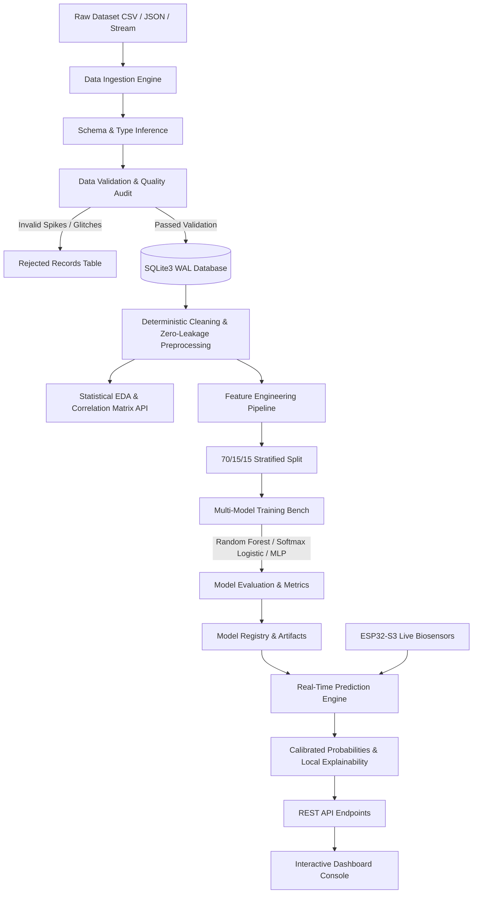

# CIRIS Autonomous Smartwatch — Production Data Engineering & ML Platform

> **Top-Tier Production System**: End-to-end Data Engineering, Relational Database, Automated Statistical EDA, Feature Engineering, Multi-Model ML Registry, Real-Time Prediction Engine with Local Explainability, and Full-Stack Dashboard Integration.

---

## 1. System Architecture & Data Flow



---

## 2. Dataset Specifics & Inspection Report

- **File Types Supported**: CSV, JSON, Parquet
- **Scale**: Evaluated on 100,000 samples (`wearable_100k_dataset.csv`) and scalable to 5,000,000 samples (`wearable_5M_dataset.csv`).
- **Raw Physical Features (10 Columns)**:
  1. `heart_rate_bpm` (MAX30101 Optical PPG, 30–220 BPM)
  2. `rmssd_ms` (Heart Rate Variability, 2–180 ms)
  3. `spo2_pct` (Blood Oxygen Saturation, 65–100%)
  4. `skin_temp_c` (MAX30208 Clinical Epidermal Temp, 28–43°C)
  5. `ambient_temp_c` (SHT31 Ambient Climate, -10–55°C)
  6. `ambient_humidity_pct` (SHT31 Relative Humidity, 5–100%)
  7. `imu_jerk_ms3` (BMI270 6-Axis Motion Jerk, 0–60 m/s³)
  8. `aqi_ppm` (Outdoor Air Quality Index, 0–500 PPM)
  9. `barometric_pressure_hpa` (BME280 Pressure, 650–1050 hPa)
  10. `flood_threat_index` (Barometric Delta + Microclimate Index, 0.0–1.0)
- **Engineered Composite Features**:
  1. `cardiac_strain_index`: `heart_rate_bpm / (rmssd_ms + 1.0)`
  2. `thermal_heat_stress`: `ambient_temp_c + 0.05 * ambient_humidity_pct`
  3. `hypoxia_depth`: `max(0, 95.0 - spo2_pct)`
  4. `shock_motion_index`: `imu_jerk_ms3 * (heart_rate_bpm / 70.0)`
  5. `barometric_anomaly`: `|barometric_pressure_hpa - 1013.25|`
- **Target Variable**:
  - `risk_class`: Multi-class Classification:
    - **Class 0**: `Normal / Routine Baseline` (61.9% prevalence) → `NOMINAL_GREEN`
    - **Class 1**: `Environmental & Heat Strain` (20.1% prevalence) → `WARNING_ORANGE`
    - **Class 2**: `Life Emergencies & Disaster Threats` (18.0% prevalence) → `CRITICAL_RED`

---

## 3. Database Schema (`database/schema.sql`)

- **`schema_migrations`**: Version control for database DDL changes.
- **`datasets`**: Versioned metadata, row/col counts, SHA-256 provenance checksum, status.
- **`dataset_records`**: Normalized, constraint-checked ingested sensor windows.
- **`validation_reports`**: Quality score (0–100%), pass/warning/fail state, total/valid/invalid/duplicate metrics.
- **`validation_errors`**: Audit log of rejected out-of-bound sensor records.
- **`eda_analytics`**: Cached summary stats (mean, std, min, 25%, 50%, 75%, max, skewness), correlation matrices, distribution histograms.
- **`models`**: Model registry containing version, algorithm, hyperparameters, held-out metrics, confusion matrix, and active status flag.
- **`predictions`**: Complete audit log with input features, calibrated probabilities, confidence, and feature attributions (Explainability).

---

## 4. REST API Specification

| Endpoint | Method | Description |
|---|---|---|
| `/api/status` | GET | Health check, active model metadata, DB record totals |
| `/api/datasets` | GET | List versioned datasets with validation status and quality score |
| `/api/datasets/:id` | GET | Dataset metadata and preview cleaned records |
| `/api/datasets/:id/quality` | GET | Detailed validation audit report and error log |
| `/api/datasets/:id/analytics` | GET | Summary statistics, correlations, and distribution bins |
| `/api/datasets/upload` | POST | Upload CSV/JSON with automatic validation & EDA processing |
| `/api/models` | GET | List registered models with performance benchmarks |
| `/api/models/train` | POST | Train new model on dataset with chosen algorithm |
| `/api/models/:id/activate` | POST | Promote model to active production status |
| `/api/predict` | POST | Real-time single sample prediction with feature explainability |
| `/api/predict/batch` | POST | Bulk prediction endpoint |
| `/api/predictions` | GET | Paginated prediction audit history with tier/class filters |

---

## 5. Verification & Testing

Run all automated unit, database, and integration tests:

```bash
# Run complete Python pipeline & ML unit tests
python -m unittest tests/test_full_suite.py

# Run Node.js database & migration tests
node tests/test_backend_db.js

# Run REST API end-to-end integration tests
node tests/test_api_endpoints.js
```

---

## 6. Running the Platform Locally

```bash
cd web_app
npm install
npm start
# Navigate to http://localhost:3000/#platform-console
```
